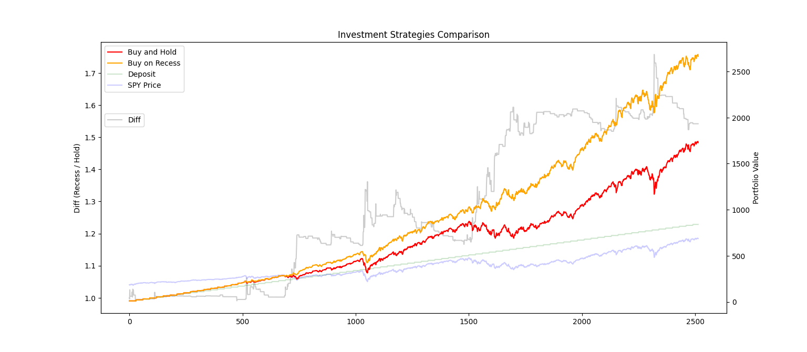

# Spy Trading Algorithm

**IT DOESNT ACTUALLY WORK!!!** (not very suprising since beating the market is almost impossible 😅)
After some review it seems like I used the "daily low" as a purchase price, which drastically skews the algorithm up. This does not reflect real-world returns.

**Please don't use this algorithm unless you want to donate money to the market** (but if you happen to want to donate money to the market, please reconsider and donate to me instead 🥺).
___
# But if you're curious on why I thought it worked...
Simulated runs show a ~54% increase in returns when using this algorithm over 2500 days against the popular buy and hold strategy. This is meant for retail traders, since liquidity is extra important here.

# How it works
Every interval of days, a set amount of "income" is recieved. The buy and hold strategy immediately purchases the maximum amount of shares whenever possible.

For my strategy (currently called "Buy on Recess", but may change later):
1. If the current price drops by over 1% from yesterdays price, **liquidate** the entire portfolio.
2. If it doesn't drop by more than 1%, use all the cash on hand to buy the stock.
3. Profit. It's really that simple.

If this actually works, I'll be rich!

# Why does it work?
Honestly, I have no idea, but I have a hypothesis.

The algorithm performs approximately the same as buy and hold for normal market conditions (probably lagging behind a percent or two), but does exceptionally well during any sort of downturn (as shown by the "diff" bar quickly spiking, denoted by the vertical lines). The performance during downturns is what I think separates this algoirthm from buy and hold.

# Sample Simulation

Interestingly, this algorithm might be able to predict the dips accurately enough to snipe the bottom of any dip, as shown by the verical lines (which coincidentally aligns at the dip(?)). A glorified buy signal.

# Side Notes
I was planning to add LEAP call options into the equation (to capitalize on major market downturns, where calls would be rotated into). However I couldn't find any SPY call option historical data that was accessible and free, so unfortunately I couldn't simulate that rotation.  
I'd guestimate (since it's only speculation), that adding 1+ year dated call options into the equation would increase the diff after 2500 days towards 70-100%. Obviously, I'm estimating. I don't know if that's actually the case since I haven't simulated it.

I'm sure there are also many other optimizations that can be made to the algorithm, but this is currently a proof-of-concept.